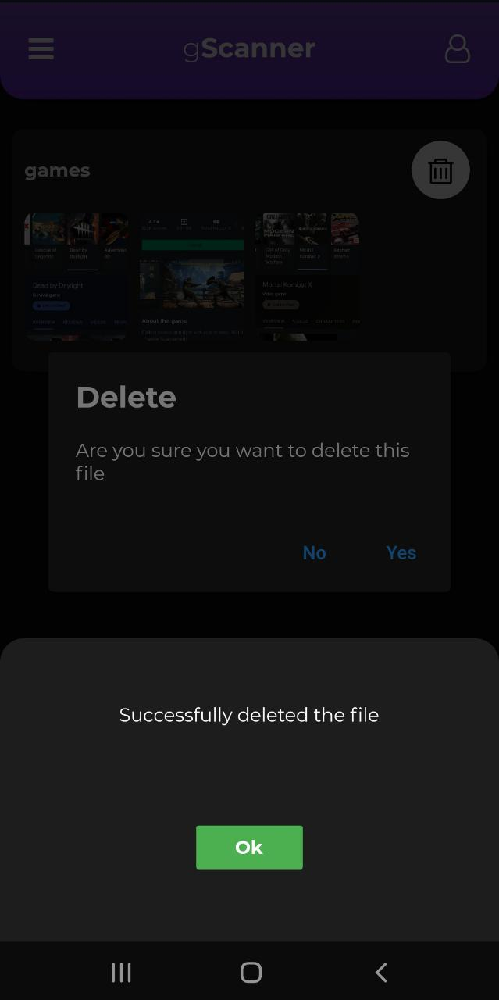

# gScanner

gScanner app is used to take images from gallery and camera and manipulate it and then create a file of it which can be saved in the cloud as well as exported as pdf. These files can be edited and deleted.

- Tech used
  - Flutter
  - Firebase
    - Auth
    - Firestore
    - Storage
  - Flare for splash screen animation

## Firebase Auth

## Firebase Firestore

## Firebase Storage

## Output

